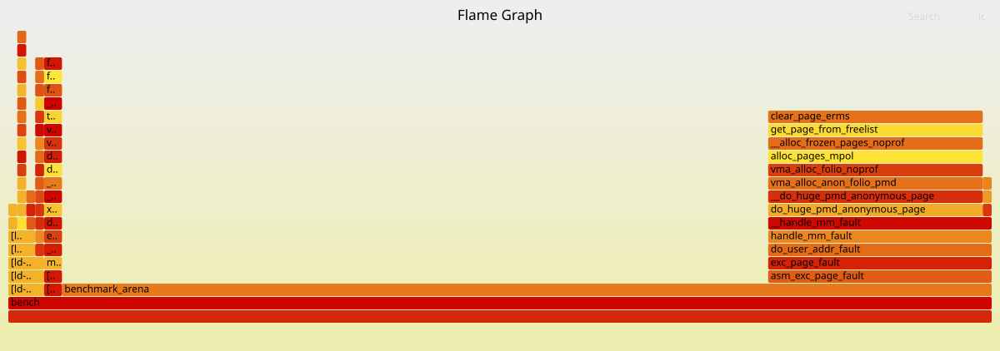
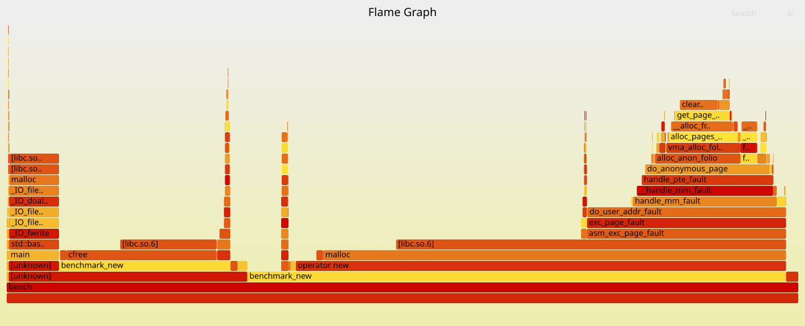
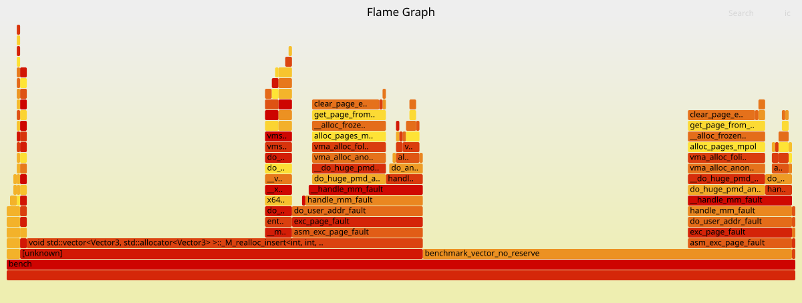

# std::vector as Arena

This project explores the performance benefits of using `std::vector::reserve` as a simple arena-like allocator compared to individual `new`/`delete` operations.

## Benchmarks
The project includes a benchmarking suite to compare:
1.  **Arena (vector reserve):** Pre-allocates memory for the vector once.
2.  **Vector (no reserve):** Uses standard vector growth (triggering reallocations).
3.  **Individual new/delete:** Allocates and deallocates every object individually on the heap.

### Latest Results
See [BENCHMARK.md](./BENCHMARK.md) for detailed timing results generated by the CI.

## Profiling and Flamegraphs
The CI/CD pipeline automatically generates flamegraphs using `perf` and [Brendan Gregg's FlameGraph tools](https://github.com/brendangregg/FlameGraph).

### Arena vs. New/Delete
You can view the profiling results below (once generated by CI):

#### Arena (Reserve)


#### Individual New/Delete


#### Vector (No Reserve)


## How to run locally
Requires `g++`, `make`, `perf`, and `FlameGraph` in the project root.

```bash
make            # Build the project
make benchmark  # Run the timing benchmarks
make flamegraphs # Generate profiling SVGs
```
